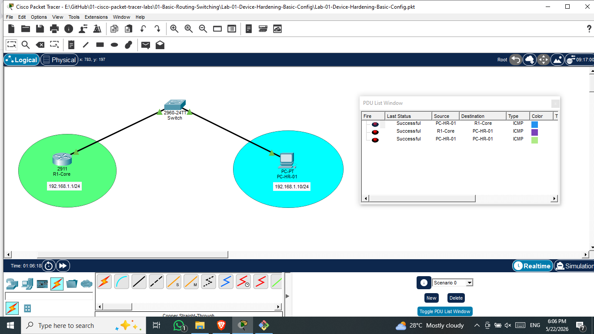

# 🌐 Lab 01: Device Hardening & Basic Configuration

## 📌 Project Overview
This laboratory experiment focuses on the fundamental concepts of securing and hardening Cisco networking hardware (Routers and Switches) before deployment into a production enterprise environment. It covers identity setup, access security, banner configurations, password encryption, and interface provisioning.

---

## 🛠️ Network Topology Diagram
Below is the verified structural topology simulated inside Cisco Packet Tracer.



---

## 🏗️ Addressing Table

| Device Name | Interface | IP Address | Subnet Mask | Default Gateway |
| :--- | :--- | :--- | :--- | :--- |
| **R1-Core** | GigabitEthernet 0/0 | `192.168.1.1` | `255.255.255.0` | *N/A* |
| **PC-HR-01** | FastEthernet 0 | `192.168.1.10` | `255.255.255.0` | `192.168.1.1` |

---

## 💻 Configuration Blueprints (Cisco IOS commands)

These standard hardening rules have been successfully injected into the global execution registry of **R1-Core**:

```cisco
! Entering global deployment scope
enable
configure terminal

! 1. Device Identity & System Performance Tuning
hostname R1-Core
no ip domain-lookup

! 2. Operational Access Security & Hardening
enable secret indika@2026
service password-encryption

! 3. Physical Console Port Protection
line console 0
 password ConsolePass#123
 login
 logging synchronous
 exit

! 4. Compliance & Legal Notification Banner
banner motd & Unauthorized Access is Strictly Prohibited! &

! 5. Interface Architecture Allocation
interface gigabitEthernet 0/0
 description Primary Local Area Network Connection
 ip address 192.168.1.1 255.255.255.0
 no shutdown
 exit

! 6. Committing Configuration into NVRAM
exit
copy running-config startup-config